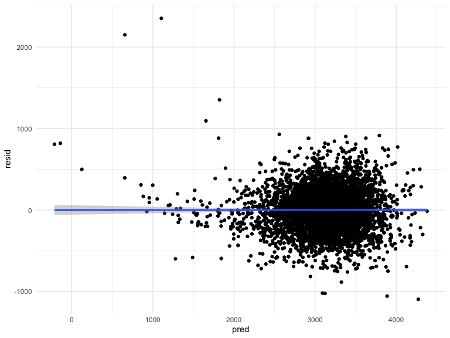
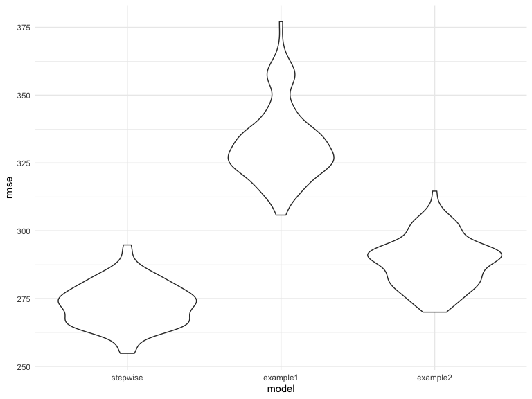
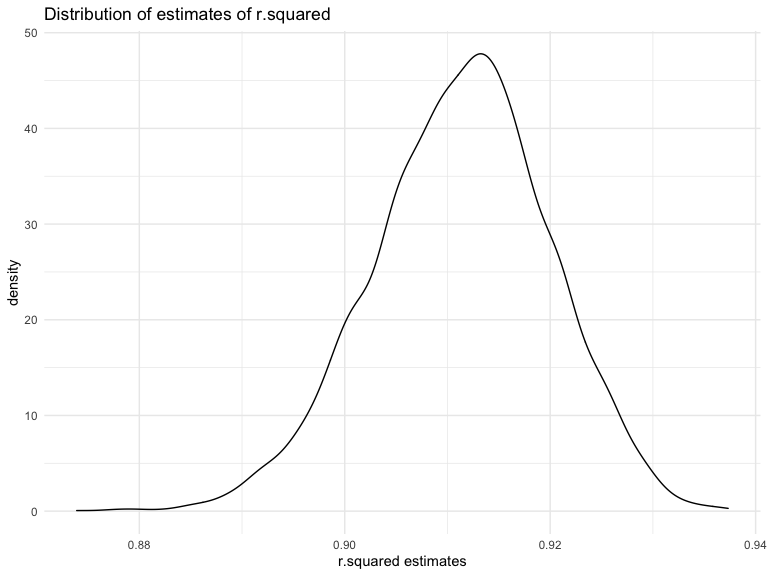
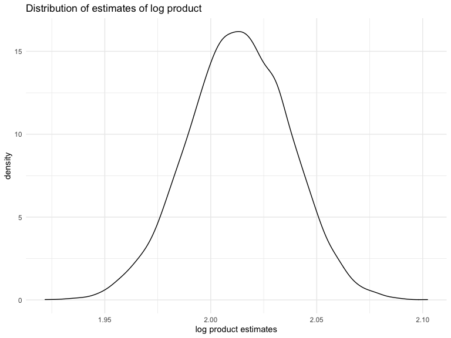

HW6
================
Chen Mo
12/7/2020

``` r
library(tidyverse)
library(modelr)
library(p8105.datasets)
```

# Problem 1

First, load and clean data.

``` r
homicide_df = 
  read_csv("data/homicide-data.csv", na = c("", "NA", "Unknown")) %>% 
  mutate(
    city_state = str_c(city, state, sep = ", "),
    victim_age = as.numeric(victim_age),
    resolution = case_when(
      disposition == "Closed without arrest" ~ 0,
      disposition == "Open/No arrest"        ~ 0,
      disposition == "Closed by arrest"      ~ 1)
  ) %>% 
  filter(
    victim_race %in% c("White", "Black"),
    city_state != "Tulsa, AL") %>% 
  select(city_state, resolution, victim_age, victim_race, victim_sex)
```

    ## Parsed with column specification:
    ## cols(
    ##   uid = col_character(),
    ##   reported_date = col_double(),
    ##   victim_last = col_character(),
    ##   victim_first = col_character(),
    ##   victim_race = col_character(),
    ##   victim_age = col_double(),
    ##   victim_sex = col_character(),
    ##   city = col_character(),
    ##   state = col_character(),
    ##   lat = col_double(),
    ##   lon = col_double(),
    ##   disposition = col_character()
    ## )

Start with the city of Baltimore, MD.

``` r
baltimore_df =
  homicide_df %>% 
  filter(city_state == "Baltimore, MD")
glm(resolution ~ victim_age + victim_race + victim_sex, 
    data = baltimore_df,
    family = binomial()) %>% 
  broom::tidy() %>% 
  mutate(
    OR = exp(estimate),
    CI_lower = exp(estimate - 1.96 * std.error),
    CI_upper = exp(estimate + 1.96 * std.error)
  ) %>% 
  select(term, OR, starts_with("CI")) %>% 
  knitr::kable(digits = 3)
```

| term              |    OR | CI\_lower | CI\_upper |
| :---------------- | ----: | --------: | --------: |
| (Intercept)       | 1.363 |     0.975 |     1.907 |
| victim\_age       | 0.993 |     0.987 |     1.000 |
| victim\_raceWhite | 2.320 |     1.648 |     3.268 |
| victim\_sexMale   | 0.426 |     0.325 |     0.558 |

Try this across cities.

``` r
models_results_df = 
  homicide_df %>% 
  nest(data = -city_state) %>% 
  mutate(
    models = 
      map(.x = data, ~glm(resolution ~ victim_age + victim_race + victim_sex, data = .x, family = binomial())),
    results = map(models, broom::tidy)
  ) %>% 
  select(city_state, results) %>% 
  unnest(results) %>% 
  mutate(
    OR = exp(estimate),
    CI_lower = exp(estimate - 1.96 * std.error),
    CI_upper = exp(estimate + 1.96 * std.error)
  ) %>% 
  select(city_state, term, OR, starts_with("CI")) 
```

Create a plot shows the estimated ORs and CIs for each city.

``` r
models_results_df %>% 
  filter(term == "victim_sexMale") %>% 
  mutate(city_state = fct_reorder(city_state, OR)) %>% 
  ggplot(aes(x = city_state, y = OR)) + 
  geom_point() + 
  geom_errorbar(aes(ymin = CI_lower, ymax = CI_upper)) + 
  theme(axis.text.x = element_text(angle = 90, hjust = 1))
```


# Problem 2

First, load and clean data.

``` r
baby_df = 
  read_csv("./data/birthweight.csv") %>% 
        janitor::clean_names() %>% 
        mutate(
                frace = case_when(
                        frace == 1 ~ "White",
                        frace == 2 ~ "Black",
                        frace == 3 ~ "Asian",
                        frace == 4 ~ "Puero Rican",
                        frace == 8 ~ "Other",
                        frace == 9 ~ "Unknown"
                ),
                mrace = case_when(
                        mrace == 1 ~ "White",
                        mrace == 2 ~ "Black",
                        mrace == 3 ~ "Asian",
                        mrace == 4 ~ "Puero Rican",
                        mrace == 8 ~ "Other",
                        mrace == 9 ~ "Unknown"
                ),
                malform = case_when(
                        malform == 0 ~ "absent",
                        malform == 1 ~ "present"),
                babysex = case_when(
                        babysex == 1 ~ "male",
                        babysex == 2 ~ "female"
                ),
                babysex = as_factor(babysex),
                frace = as_factor(frace),
                malform = as_factor(malform),
                mrace = as_factor(mrace)
        ) %>% 
        na.omit()
```

    ## Parsed with column specification:
    ## cols(
    ##   .default = col_double()
    ## )

    ## See spec(...) for full column specifications.

I use both-way stepwise method to fit a model.

``` r
model_fit %>% 
        broom::tidy() %>% 
        knitr::kable()
```

| term             |       estimate |   std.error |   statistic |   p.value |
| :--------------- | -------------: | ----------: | ----------: | --------: |
| (Intercept)      | \-6070.2638943 | 136.9081478 | \-44.338222 | 0.0000000 |
| babysexmale      |   \-28.5580171 |   8.4548958 |  \-3.377690 | 0.0007374 |
| bhead            |    130.7770408 |   3.4465672 |   37.944144 | 0.0000000 |
| blength          |     74.9471109 |   2.0190479 |   37.120027 | 0.0000000 |
| delwt            |      4.1067316 |   0.3920592 |   10.474775 | 0.0000000 |
| fincome          |      0.3180229 |   0.1747477 |    1.819898 | 0.0688436 |
| gaweeks          |     11.5924873 |   1.4620657 |    7.928842 | 0.0000000 |
| mheight          |      6.5940377 |   1.7848817 |    3.694383 | 0.0002231 |
| mraceBlack       |  \-138.7924801 |   9.9070869 | \-14.009414 | 0.0000000 |
| mraceAsian       |   \-74.8867755 |  42.3146313 |  \-1.769761 | 0.0768374 |
| mracePuero Rican |  \-100.6781427 |  19.3246910 |  \-5.209819 | 0.0000002 |
| parity           |     96.3046933 |  40.3362158 |    2.387549 | 0.0170038 |
| ppwt             |    \-2.6755853 |   0.4273585 |  \-6.260752 | 0.0000000 |
| smoken           |    \-4.8434197 |   0.5855757 |  \-8.271210 | 0.0000000 |

by using step function in R, I fit a model using predictors shown above.

I use R to create a plot of model residuals against fitted values.

``` r
baby_df %>% 
  modelr::add_residuals(model_fit) %>% 
  add_predictions(model_fit) %>% 
  ggplot(aes(x = pred, y = resid)) + 
        geom_point() + 
        geom_smooth(method = "lm")
```

    ## `geom_smooth()` using formula 'y ~ x'



Then, I compare my model to two others in terms of the cross-validated
prediction error.

``` r
model_fit =
  terms(model_fit) %>% 
  attr("term.labels") %>% 
  str_c(.,collapse = "+") %>% 
  str_c("bwt~",.) %>% 
  as.formula()
set.seed(1)
cv_df = crossv_mc(baby_df, 100)
cv_df = 
        cv_df %>% 
        mutate(
                train = map(train, as_tibble),
                test = map(test, as_tibble)
        ) %>% 
        mutate(
                md_stepwise = map(.x = train, ~ do.call("lm", list(model_fit, data = .x))),
                md_example1 = map(.x = train, ~lm(bwt ~blength + gaweeks, data = .x)),
                md_example2 = map(.x = train, ~lm(bwt ~blength * bhead *babysex, data = .x))
        ) %>% 
        mutate(
                rmse_stepwise = map2_dbl(md_stepwise, test, ~rmse(model = .x, data = .y)),
                rmse_example1 = map2_dbl(md_example1, test, ~rmse(model = .x, data = .y)),
                rmse_example2 = map2_dbl(md_example2, test, ~rmse(model = .x, data = .y)))
```

Then, I make a plot to make this comparison more straightforward.

``` r
cv_df %>% 
  select(starts_with("rmse")) %>% 
  pivot_longer(
    everything(),
    names_to = "model", 
    values_to = "rmse",
    names_prefix = "rmse_") %>% 
  mutate(model = fct_inorder(model)) %>% 
  ggplot(aes(x = model, y = rmse)) + geom_violin()
```



From the plots above, we can see that the model which I fit(using
both-way stepwise method) has lowest RMSE compared to other two models.
And the second example model has lower RMSE compared to the first
example mode.

# Problem 3

Load the data.

``` r
weather_df = 
  rnoaa::meteo_pull_monitors(
    c("USW00094728"),
    var = c("PRCP", "TMIN", "TMAX"), 
    date_min = "2017-01-01",
    date_max = "2017-12-31") %>%
  mutate(
    name = recode(id, USW00094728 = "CentralPark_NY"),
    tmin = tmin / 10,
    tmax = tmax / 10) %>%
  select(name, id, everything())
```

    ## Registered S3 method overwritten by 'hoardr':
    ##   method           from
    ##   print.cache_info httr

    ## using cached file: /Users/a123123/Library/Caches/R/noaa_ghcnd/USW00094728.dly

    ## date created (size, mb): 2020-12-07 05:09:43 (7.536)

    ## file min/max dates: 1869-01-01 / 2020-12-31

Produce bootstrap sample

``` r
set.seed(1)
boot_strap = 
        weather_df %>% 
        modelr::bootstrap( n = 5000) %>% 
        mutate(
                models = map(.x = strap, ~lm(tmax~tmin, data = .x)),
                results_tidy = map(models, broom::tidy),
                results_glance = map(models, broom::glance)
        ) %>% 
        select(-strap, -models) %>% 
        unnest(results_tidy, results_glance) %>% 
        select(.id, term, estimate, r.squared) %>% 
        pivot_wider(names_from = term,
                    values_from = estimate) %>% 
        mutate(
                log_beta1_2 = log(`(Intercept)`*tmin)
        ) %>% 
        select(.id, r.squared, log_beta1_2)
```

Then I will identify the 0.025 and 0.975 quantiles to provide a 95%
confidence interval for r.squared and log(β̂ 0∗β̂ 1).

``` r
quantile(boot_strap$r.squared, probs = c(0.025,0.975)) %>% 
  knitr::kable(caption = "95% CI for r.suqared")
```

|       |         x |
| :---- | --------: |
| 2.5%  | 0.8936684 |
| 97.5% | 0.9271060 |

95% CI for r.suqared

``` r
quantile(boot_strap$log_beta1_2, probs = c(0.025,0.975)) %>% 
  knitr::kable(caption = "95% CI for log beta 0 and beta 1")
```

|       |        x |
| :---- | -------: |
| 2.5%  | 1.964949 |
| 97.5% | 2.058887 |

95% CI for log beta 0 and beta 1

Lastly, I will plot the distribution of r squared estimates and the
distribution of log \(\beta 1\) \* \(\beta 2\) estimates.

``` r
ggplot(data = boot_strap, aes(x = r.squared)) +
  geom_density() +
      labs(
        title = "Distribution of estimates of r.squared",
        x = "r.squared estimates")
```



``` r
ggplot(data = boot_strap, aes(x = log_beta1_2)) +
  geom_density() +
    labs(
        title = "Distribution of estimates of log product",
        x = "log product estimates")
```



As we can see, both the distributions of estimates of r squared and log
\(\beta 1\) \* \(\beta 2\) estimates are approximately normal
distribution. Besides, a very large proportion of r square are more than
0.9, and this indicates that tmin is a very good indicator of tmax.
